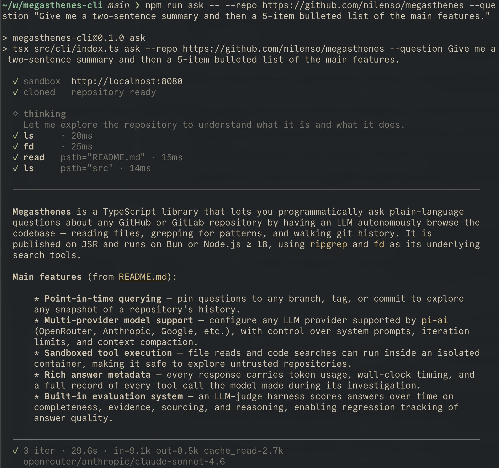

# megasthenes-cli

Terminal CLI for [megasthenes](https://github.com/nilenso/megasthenes) — ask natural-language questions about any Git repository and get a source-cited, markdown-rendered answer.



```bash
megasthenes ask --repo https://github.com/owner/repo --question "What does this project do?"
```

Full library docs: [nilenso.github.io/megasthenes](https://nilenso.github.io/megasthenes/).

## Install

Requires **Node.js ≥ 18** plus `git`, `ripgrep`, and `fd` on `PATH`.

```bash
# macOS
brew install git ripgrep fd

# Debian / Ubuntu (fd binary may be `fdfind`)
sudo apt install git ripgrep fd-find
```

The package is published to [JSR](https://jsr.io/@nilenso/megasthenes-cli) as `@nilenso/megasthenes-cli`. JSR exposes packages to npm/bun under the `@jsr` scope, so first point that scope at JSR's npm registry:

```bash
echo "@jsr:registry=https://npm.jsr.io" >> ~/.npmrc
```

Then install globally with your package manager of choice:

```bash
# npm
npm install -g @jsr/nilenso__megasthenes-cli

# bun
bun install -g @jsr/nilenso__megasthenes-cli
```

Either installs a `megasthenes` executable on your `PATH`.

## Configure

Export your LLM provider's API key:

| Provider   | Env var                |
| ---------- | ---------------------- |
| OpenRouter | `OPENROUTER_API_KEY`   |
| Anthropic  | `ANTHROPIC_API_KEY`    |
| OpenAI     | `OPENAI_API_KEY`       |
| Google     | `GOOGLE_CLOUD_API_KEY` |

Pin defaults in `~/.config/megasthenes/config.json` (override with the `MEGASTHENES_CONFIG` env var). Keys are the camelCase form of the CLI flags:

```json
{
  "provider": "openrouter",
  "model": "anthropic/claude-sonnet-4.6",
  "thinkingEffort": "medium"
}
```

Precedence: CLI flags > env vars > config file > built-in defaults.

## Usage

```bash
megasthenes ask --repo <url> --question "<text>" [options]
```

```bash
# Pin to a tag
megasthenes ask --repo https://github.com/owner/repo --question "Summarize the data model." \
  --commitish v2.3.0

# Suppress the activity log — handy for piping
megasthenes ask --repo https://github.com/owner/repo --question "List public APIs." \
  --response-only > apis.md
```

Run `megasthenes ask --help` for the full flag reference.

For untrusted repositories, run tool execution in an isolated container via the [sandbox worker](https://nilenso.github.io/megasthenes/guides/sandbox/) and point the CLI at it with `--sandbox-base-url` and `--sandbox-secret`.

## Exit codes

| Code | Meaning                                               |
| ---- | ----------------------------------------------------- |
| 0    | success                                               |
| 1    | `internal_error`                                      |
| 2    | `max_iterations` (gave up before producing an answer) |
| 3    | `context_overflow`                                    |
| 4    | `provider_error` / `network_error` / `empty_response` |
| 64   | invalid CLI usage                                     |
| 130  | aborted (Ctrl-C)                                      |

## Development

```bash
git clone https://github.com/nilenso/megasthenes-cli
cd megasthenes-cli
npm install
npm test
```

Published to JSR as [`@nilenso/megasthenes-cli`](https://jsr.io/@nilenso/megasthenes-cli).

## License

MIT © nilenso
